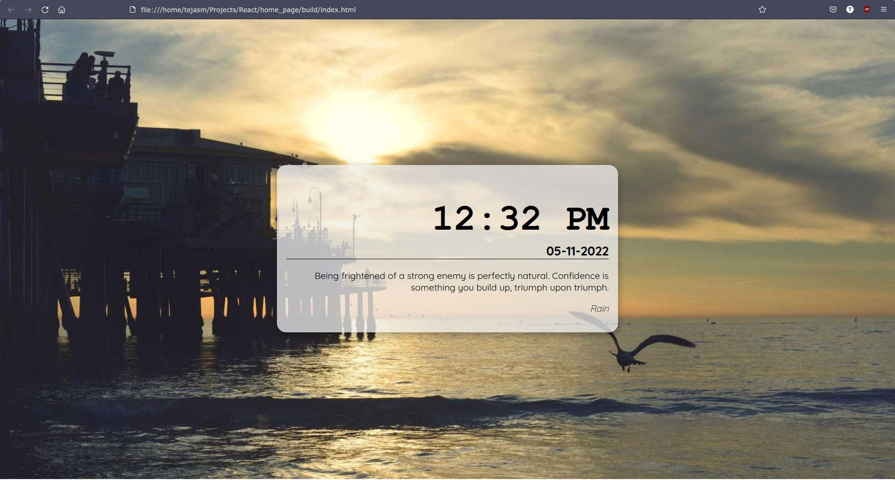
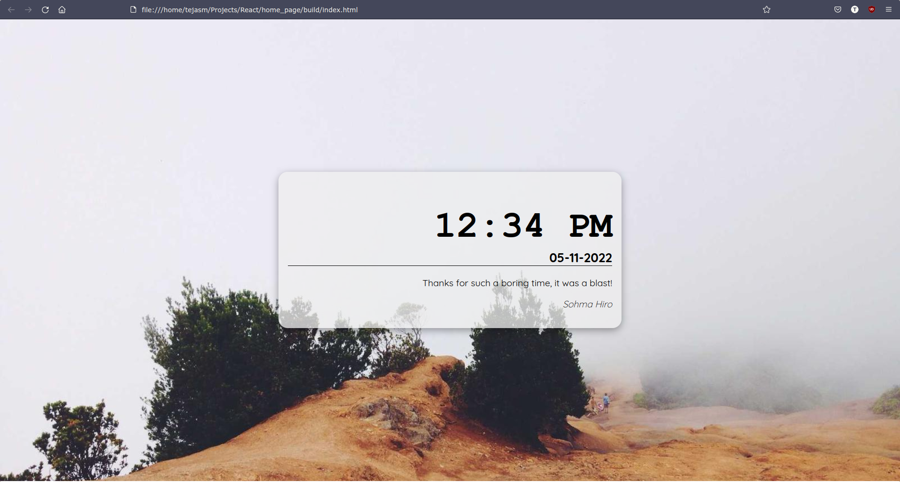

# Introduction

Hello Everyone, this is my first attemp for creating a react aplication for my need, i wanted a clean looking browser home page on startup, so this is what I created, hope you like it.

It displays current time and a random anime quote. The quote is updated on each refresh.
> Due to the nature of the API used there is a limit of 100 quotes per hour

 

# There are two ways to run this as:

## Launching it as a Static page

1. Navigate to Build section
2. There you will find index.html file you can launch it directly.

## Using React itself

In the project directory, you can run:

### `npm start`

Runs the app in the development mode.\
Open [http://localhost:3000](http://localhost:3000) to view it in your browser.

The page will reload when you make changes.\
You may also see any lint errors in the console.

>The above method is helpful for devs and for one who want to fork the above project, for people who just want to use a nice clean browser home page use the method below
